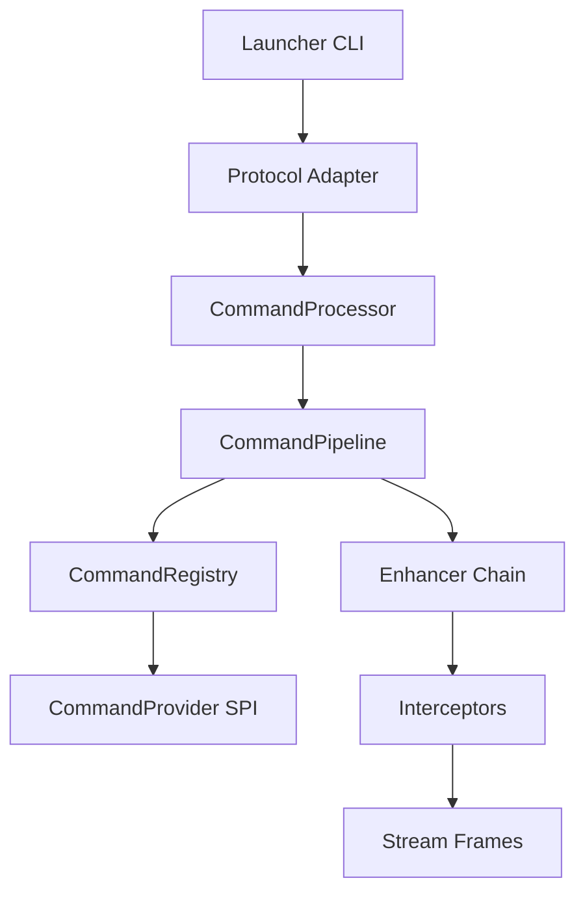

# Technical Design: 命令插件化与流式诊断（细化版）

## Technical Solution
### Core Technologies
- Java 8 / Maven
- ServiceLoader + 可选插件目录扫描
- Socket 文本协议 + 轻量分帧编码
- 现有 Security/Monitoring/Enhancement 模块复用

### Implementation Key Points
- **CommandProvider SPI**：插件通过 provider 暴露命令与元数据（是否可缓存/是否流式/权限级别）
- **CommandRegistry**：统一注册内置与插件命令，冲突策略可配置
- **CommandPipeline**：解析→校验→鉴权→审计→缓存→执行→输出清洗
- **Framed/Stream Protocol**：支持 DATA/END/ERR 分帧与流式输出
- **Enhancer 叠加**：同一类支持多个 enhancer 组合，按会话 ID 管理
- **背压与采样**：watch/trace 队列上限、丢弃策略、采样率可配置

## Architecture Design


## Architecture Decision ADR
### ADR-002: 插件化命令与分帧协议并行兼容
**Context:** 现有命令硬编码与响应边界不稳定  
**Decision:** 引入插件化注册与分帧协议，默认兼容旧协议  
**Rationale:** 降低兼容风险，保持渐进式升级  
**Alternatives:** 全量替换为 JSON/HTTP → 兼容与成本过高  
**Impact:** 引入协议适配层与命令注册表

## API Design
### 协议模式
- **legacy**：保持现有逐行响应（兼容）
- **framed**：启用分帧协议

### 分帧协议（framed）
**请求：**
- `CMD <line>`：单次命令
- `STREAM <line>`：流式命令（watch/trace）

**响应：**
- `DATA <len>\n<payload>`：输出分帧
- `END`：命令结束
- `ERR <len>\n<payload>`：错误响应

### 会话与权限
- 新连接默认 `viewer`
- `auth <user> <password>` 提升角色（可配置禁用）
- 高危命令需要 `operator/admin` 权限

## Data Model
```text
Frame {
  type: DATA|END|ERR
  length: int
  payload: bytes
}
```

## Security and Performance
- **Security:** 插件目录白名单；命令权限校验；输入输出清洗；审计全链路
- **Performance:** 事件流队列上限；丢弃/采样策略；命令超时与缓存分层

## Testing and Deployment
- **Testing:** 分帧编码/解码、插件加载、权限链路、流式输出回归
- **Deployment:** 默认 legacy 模式；通过配置启用 framed/stream

