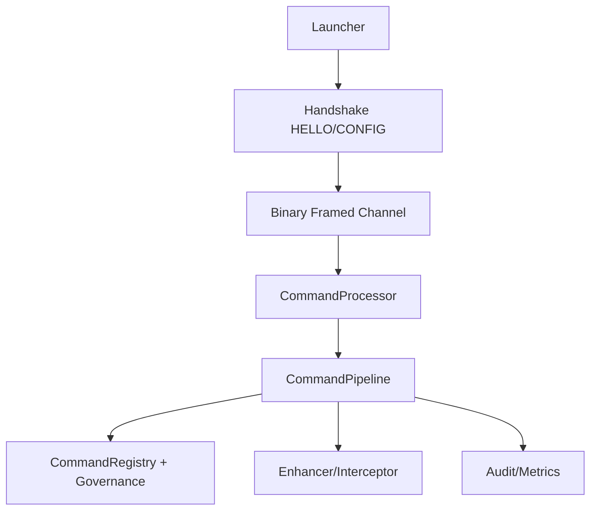

# Technical Design: 握手协商 + 严格帧协议 + 插件授权治理

## Technical Solution
### Core Technologies
- Java 8 / Maven
- TCP Socket（控制面）
- 二进制长度前缀帧协议（DataInputStream/DataOutputStream）
- 可选 TLS（JSSE）
- HMAC-SHA256（共享密钥签名）+ nonce 防重放

### Implementation Key Points
1) **Handshake**
- 新增 HELLO/CONFIG 两阶段握手：版本协商、能力协商（framed/streaming/security）
- 支持降级：若握手失败→回落 legacy

2) **Binary Framing**
- Frame Header: magic + version + type + flags + length
- payload 按 length 精确读取，支持多帧流式输出
- 错误与结束帧明确

3) **Security**
- 安全模式 `security.mode`：off | hmac | tls
- HMAC 模式：每条请求包含 `{timestamp, nonce, payloadHash}`，签名 = HMAC(secret, fields)
- 服务端维护 nonce LRU/TTL 防重放
- 移除默认口令；首次启动生成临时 token 并要求用户配置落盘

4) **Plugin Authorization Governance**
- 扩展 CommandMeta：requiredRole/dangerous/rateLimit/source
- 插件 provider 提供 meta；服务端对 meta 做“可注册/可执行”决策
- 新增配置：允许的插件来源/目录、允许的命令清单、危险命令二次确认

5) **Self-Protection & Observability**
- Transformer：增强失败自动回退 + 指标上报
- Interceptor：背压/采样策略的 drop 计数与速率指标
- MetricsCollector：新增协议错误、鉴权拒绝、插件加载统计

## Architecture Design

## Architecture Decision ADR
### ADR-003: 采用握手协商与二进制帧协议
**Context:** 现有 readLine 分帧不可靠，且配置跨进程不一致  
**Decision:** 增加 HELLO/CONFIG 握手与二进制长度前缀帧协议，支持能力协商与降级  
**Rationale:** 可靠性与兼容性兼得，便于后续加入安全字段  
**Alternatives:** 直接切换到 HTTP/WebSocket → 成本与部署复杂度更高  
**Impact:** 需要新增协议层与安全上下文、测试覆盖

## API Design
### Handshake
- Client → Server: `HELLO`（支持版本、期望能力、客户端随机数）
- Server → Client: `CONFIG`（协议版本、端口、maxFrame、securityMode、serverNonce）

### Binary Frame
Header:
- magic: 0x534C4555 ("SLEU")
- version: u8
- type: u8 (CMD/STREAM/DATA/ERR/END)
- flags: u16
- length: u32

Payload:
- bytes[length]

## Security and Performance
- **Security:** 默认 `security.mode=off`（先保证兼容与稳定）；后续可逐步启用 HMAC + nonce + timestamp；可选 TLS；禁用默认口令；插件白名单
- **Performance:** 读写使用缓冲流；大输出分片；drop/采样可观测

## Testing and Deployment
- **Testing:** 协议编解码边界、握手降级、插件授权矩阵、并发会话与增强回退；安全开启场景补充重放攻击用例
- **Deployment:** `security.mode` 初始为 `off`；默认 legacy；开启握手与 framed 后可逐步启用 `hmac/tls`
