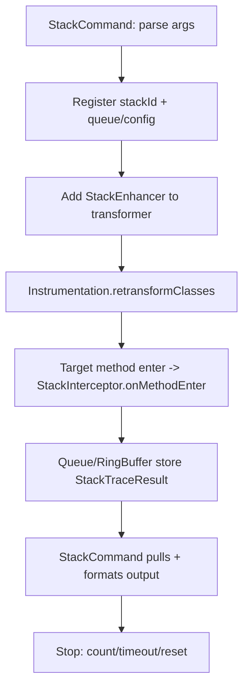

# 技术设计: Arthas 核心能力补齐（Stack 追踪 + TT Replay Lite）

## 技术方案

### 核心技术
- Java Agent + Instrumentation（动态 attach 与 retransformation）
- ASM（字节码插桩）
- Socket 命令通道（现有 CommandProcessor / protocol）
- 受控输出与输入校验（SecurityValidator / InputValidator / SleuthValueFormatter）

### 实现要点
1. `stack` 方法追踪采用“插桩 + 事件上报”模式：
   - 在目标方法入口（onMethodEnter）触发拦截器记录调用栈。
   - 事件写入队列/环形缓冲区，由命令端拉取并输出。
2. 保留原 `stack monitor`（采样/监控）逻辑：
   - 通过参数分支实现一套命令两种模式，避免破坏兼容性。
3. `tt replay` 采用“生成模板，不执行”策略：
   - 复用现有 tt 记录结构，生成可读的复现信息与代码骨架。
   - 不在目标 JVM 执行反射调用，规避副作用与权限风险。
4. 插桩健壮性：
   - 增加 ASM + 自定义 ClassLoader 的单测，验证插桩后返回值/异常路径不变。
   - 把“字节码栈语义破坏”作为主要风险点持续回归。

## 架构设计

### Stack（方法追踪）数据流

## 架构决策 ADR

### ADR-001: TT Replay 仅生成模板，不在目标 JVM 执行
**Context:** 直接 replay 需要记录目标对象/类加载器/上下文，并可能造成业务副作用与安全风险。

**Decision:** 本轮实现 replay-lite：仅输出复现信息与代码模板。

**Rationale:** 满足“可复现”核心诉求同时保持简化与安全。

**Alternatives:**
- 方案 A：记录 this 并反射调用 → 拒绝原因：高副作用/内存泄漏风险/权限复杂
- 方案 B：引入脚本/OGNL 执行 → 拒绝原因：违背“简化实现”与安全边界

**Impact:** replay 不能“一键执行”，但能显著降低复现成本；未来若扩展执行版需 admin 权限与显式风险确认。

## 安全与性能
- **输入校验:** stack 追踪的 class/method/desc 与现有 watch/trace 同等级校验；新增参数（如 `--depth`）做范围限制。
- **输出安全:** 栈输出默认限制深度并过滤内部框架栈；对象值输出继续走 SleuthValueFormatter（限深/限长/脱敏）。
- **性能控制:** 强制要求 `-n` 或 `-t`（至少其一），并提供 `--depth`；必要时接入采样率（ProductionConfig）。

## 测试与验证
- 单元测试：新增 enhancement 级测试，覆盖返回值/异常路径。
- 回归测试：`mvn test`。
- 手工验证：附带 demo 应用调用，执行 `stack <class> <method>` 与 `tt replay <id>` 验证输出可用性。
