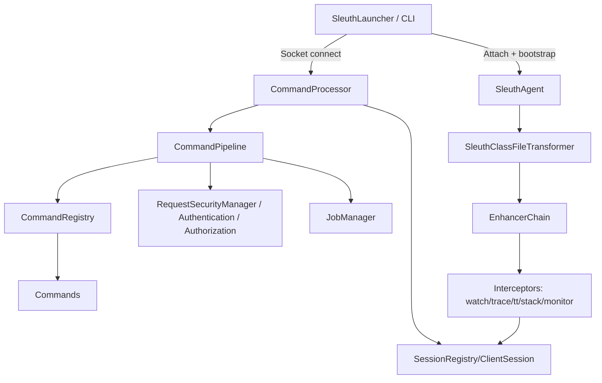

# Technical Design: 安全/权限/协议/采集链路重构（长期演进）

## Technical Solution

### Core Technologies
- Java 8（运行时与编译基线）
- ASM（字节码增强）
- Attach API（本地 attach 注入 agent）
- JLine（交互式 CLI）
- Jackson（协议/审计/指标序列化）
- re2j（可选：安全正则/搜索能力）

### Implementation Key Points

#### 1) 默认安全姿态：从“靠 bind 地址”升级为“默认可自证安全”
1. 将默认配置从 `security.mode=off` 调整为 `security.mode=hmac`（保持 `server.bind.address=127.0.0.1` 仍为默认）。
2. 复用现有 “attach 阶段 bootstrap secret” 机制（`security.bootstrap.hmac.on.attach=true`），让本地单机排障保持低摩擦：用户无需手工设置 secret，也能开箱即用。
3. 引入显式不安全开关：
   - CLI：`--insecure`（仅当用户明确指定时才允许以 `security.mode=off` 运行）
   - 交互确认：对 `--insecure` 追加短语确认（避免脚本误用）

#### 2) 协议与握手演进：统一版本协商 + 会话身份 + 能力声明
1. 抽象统一握手层（适用于 `legacy` 与 `framed`）：
   - 版本协商（协议版本/能力位）
   - 会话标识（sessionId / connId）
   - 角色与权限（viewer/operator/admin；服务端最终裁决）
   - 安全模式（off/hmac/password）与认证材料
   - 限制声明（payload/line 最大长度、是否 streaming）
2. 服务端在处理任何业务命令前，必须完成握手（握手失败直接关闭连接并记录审计）。
3. 向后兼容策略：
   - 同版本：保持原行为
   - 跨版本：优先协商到共同子集；无法协商则输出明确错误与迁移提示

#### 3) 授权策略 SSOT：以 CommandMeta 为唯一来源
1. 约束 `CommandProvider` 必须提供：
   - `Map<String, Command> getCommands()`
   - `CommandMeta getCommandMeta(String commandName)`（对每个命令返回 meta）
2. 将授权逻辑收敛为：
   - `AuthorizationManager`：只实现“通用策略引擎”（requiredRole / dangerous / audit / rate limit）
   - 避免按命令名写 switch 特判；如有特殊策略，必须通过 meta 表达（例如 `withDangerous`、`withAudit`、`maxExecutionsPerMinute`）。
3. 插件命令策略：
   - 若插件未提供 meta：默认降权为 viewer 或拒绝加载（需在 ADR 中选择其一，并写明理由）

#### 4) 采集链路会话化：按连接隔离资源，避免全局残留
1. 目标：将 watch/trace/tt/stack/monitor 的状态从“全局 ConcurrentHashMap keyed by sessionId”演进为“每连接/每会话对象持有”。
2. 引入会话对象模型（示意）：
   - `ClientSession`：绑定 clientId/sessionId/role/协议能力/关闭钩子
   - `SessionRegistry`：管理活动会话与 TTL 回收
   - `SessionMonitorState`：持有 trace/watch/tt 等队列与统计计数器
3. 连接关闭即释放：
   - `CommandProcessor` 在 socket 关闭时触发 `SessionRegistry#close(sessionId)`
   - 采集侧不再用静态 map；通过 sessionId 取回 session state，不存在则丢弃并计数
4. 可观测性：
   - 统一把 published/dropped/evicted/sampled 输出到 `metrics`/`status` 命令与审计日志
   - 支持运行时调参（采样率、队列容量、drop 策略），并记录变更审计

#### 5) Trace ThreadLocal 风险收敛：强清理 + 上限 + 可降级
1. 将 per-thread 状态结构从 “ThreadLocal<Map<...>>” 收敛为更小、可控的结构：
   - 深度上限（避免递归/重入导致无限增长）
   - 条目上限（避免异常路径残留扩大）
2. 所有增强回调必须使用 `try/finally` 确保清理，必要时调用 `ThreadLocal.remove()`。
3. 异步边界策略：
   - 默认：仅保证单线程内的调用链一致性
   - 可选：提供配置项允许“根调用采样”或“禁用跨线程关联”，并在文档明确限制

#### 6) 高危命令：二次确认 + 审计增强 + 回滚 SOP
1. 对 `CommandMeta.dangerous=true` 的命令默认启用二次确认：
   - 交互式：用户输入确认短语（例如 `I UNDERSTAND`）
   - 非交互：提供 `--confirm-token`（一次性 token，有时效）
2. 审计增强：
   - 在 `AuditLogger` 中记录：操作者（会话/角色/来源）、命令、参数摘要、确认方式、理由（可选）、执行结果
3. 文档与 SOP：
   - 增加 “如何回滚 redefine/retransform” “如何应对 heapdump 导致 STW/磁盘满”等流程

## Architecture Design

## Architecture Decision ADR

### ADR-001: 默认启用 HMAC 且 attach 阶段自动 bootstrap secret
**Context:** 默认 `security.mode=off` 在误暴露场景存在高风险，但本地单机排障需要低摩擦体验。  
**Decision:** 默认 `security.mode=hmac`；保留 `security.bootstrap.hmac.on.attach=true` 以实现开箱即用。  
**Rationale:** 用“默认安全”降低运维误配风险，同时通过 bootstrap 避免增加用户负担。  
**Alternatives:** 继续默认 off → Rejection reason: 误暴露风险仍主要靠运维兜底。  
**Impact:** 默认行为变化，需要 CLI 与文档提供迁移提示与 `--insecure` 逃生门。  

### ADR-002: 授权策略以 CommandMeta 为单一 SSOT
**Context:** 当前存在 meta + 特判双来源，容易产生策略漂移。  
**Decision:** `AuthorizationManager` 只消费 `CommandMeta`，禁止按命令名写策略分支；特殊策略通过 meta 表达。  
**Rationale:** 提升可维护性、一致性与可测试性。  
**Alternatives:** 保留特判 → Rejection reason: 演进成本高且容易遗漏。  
**Impact:** 需要补齐插件命令 meta 策略，并加强测试覆盖。  

### ADR-003: 采集链路状态会话化，连接关闭即释放
**Context:** 全局 map + sessionId 模式在异常/断连/重连场景容易残留，且资源边界不清晰。  
**Decision:** 引入 `ClientSession/SessionRegistry`，采集状态挂在会话对象上并随连接生命周期管理。  
**Rationale:** 资源隔离更清晰、便于回收与观测，并降低“残留导致内存增长”的风险。  
**Alternatives:** 保持全局 map → Rejection reason: 长期风险与可维护性问题难收敛。  
**Impact:** 需要调整拦截器与命令交互接口，属于较大改造，需分阶段落地与压测验证。  

## API Design

> 本项目主要通过本地 socket 协议交互；本次变更建议把握手与错误码规范化，并在 `docs/usage/commands.md` 与 `docs/ops/*` 增补兼容与排错说明。

## Data Model

不引入持久化数据；会话状态与指标均为进程内结构。

## Security and Performance

- **Security:**
  - 默认启用 HMAC；非交互不安全模式需要显式参数并记录审计
  - 握手强制在业务命令前完成；失败即断开
  - 权限策略 SSOT + `dangerous` 二次确认 + 强审计
  - 插件命令需 meta 才能加载或执行（防止策略绕过）
- **Performance:**
  - 继续使用有界队列 + 丢弃 + 采样作为默认风险控制
  - 会话化减少全局残留；指标化帮助定位瓶颈与丢弃原因
  - Trace ThreadLocal 上限与清理，避免线程池复用导致的隐性增长

## Testing and Deployment

- **Testing:**
  - 单测增强：握手/鉴权/不安全模式确认、权限 meta 一致性、会话关闭资源回收、Trace 异常路径清理
  - 兼容测试：legacy/framed 协议协商与降级路径
  - 性能/压测：热点方法 watch/trace 下的丢弃率、GC、CPU 开销基线对比
- **Deployment（本地单机优先）：**
  - 默认无需配置 secret（attach 自动 bootstrap）
  - 需要暴露端口时必须启用安全模式并记录审计；文档提供端口转发与误暴露排查指南

