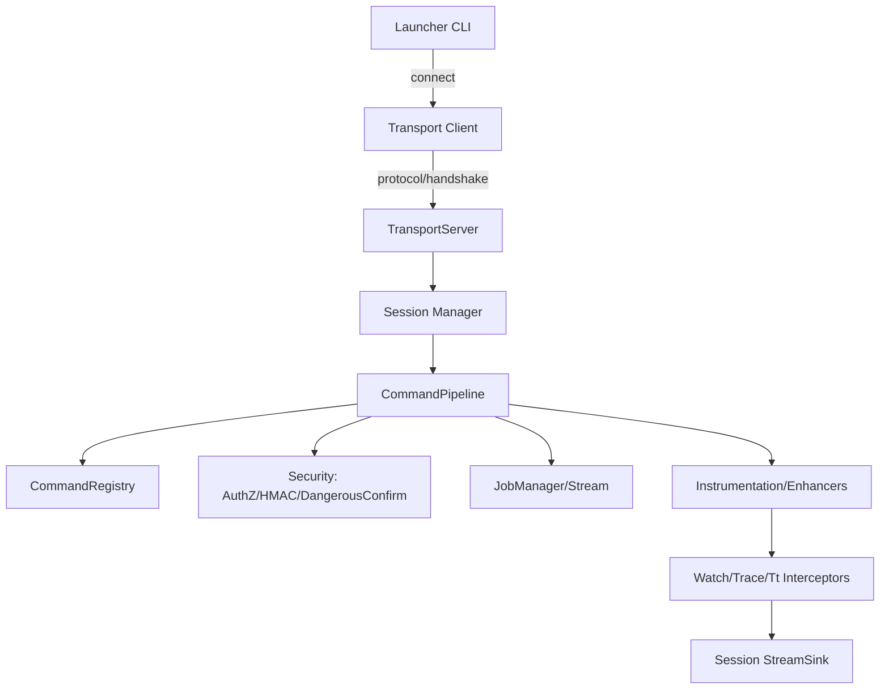

# 技术设计：事件驱动通信重构与诊断能力加固（Solution 3）

## 技术方案

### 核心技术
- Java 8
- Netty（事件驱动 NIO，具体版本在实施阶段确定并做 CVE 检查）
- 现有协议能力复用：framed/binary、握手、HMAC 签名（`SIG v=2`）
- 现有增强框架复用：ASM + `ClassFileTransformer`

### 关键实现要点

1. **抽象 Transport 层**：引入 `TransportServer` 接口，提供 `BioTransportServer`（复用现有 ServerSocket 实现）与 `NettyTransportServer`（新实现）。
2. **连接→会话→资源**：将连接生命周期事件映射为会话生命周期（open/authenticated/closed），在 close 时触发“会话资源自动清理”。
3. **背压与过载策略**：
   - 网络层：对输入速率与帧大小做硬限制（`protocol.frame.max.payload` 等）。
   - 执行层：将命令执行队列改为有界，并对过载返回明确错误码（而非无限排队）。
4. **HMAC 默认行为自洽**：
   - loopback 绑定下允许“空 secret → 自动生成临时 secret”，并明确输出引导信息；
   - 非 loopback 仍保持严格安全边界（拒绝或强制配置 secret）。
5. **缓存策略单一来源**：以 `CommandMeta` 为缓存唯一开关，缓存键统一包含会话/客户端维度；清理命令内部“自建缓存”或强制命名空间一致。
6. **重型命令治理统一化**：为命令增加“影响等级”元数据，在 pipeline 层统一做二次确认、并发限制、速率限制、以及审计记录。

## 架构设计

## Architecture Decision ADR

### ADR-001: 引入 Transport 抽象并采用 Netty 事件驱动 IO
**Context:** 当前 BIO + 无界队列在洪泛场景下存在结构性风险；同时连接生命周期缺少清晰事件，难以做会话资源治理。  
**Decision:** 引入 `TransportServer` 抽象，新增 `NettyTransportServer` 作为事件驱动实现，并保留 `BioTransportServer` 作为回退。  
**Rationale:** Netty 提供成熟的背压与连接生命周期事件，同时通过抽象层降低重构风险、支持灰度/回滚。  
**Alternatives:** 直接在现有 BIO 上小修补（有界队列 + 连接清理） → 拒绝原因：无法从根上改善连接生命周期与背压能力，仍易形成“修修补补的复杂度”。  
**Impact:** 引入新依赖与更多协议/测试工作；需要明确兼容策略与安全边界。

### ADR-002: 以“会话资源归属表”实现增强规则的自动清理
**Context:** watch/trace/tt 的增强是 JVM 级全局副作用，连接断开后残留会造成跨会话污染与隐性开销。  
**Decision:** 引入 `SessionResourceRegistry`，所有注册类操作必须写入 owner(sessionId)；会话关闭时执行资源回收（unregister/stop/jobs 清理）。  
**Rationale:** 不依赖线程上下文（增强运行于业务线程），以显式 owner 建模最可靠。  
**Alternatives:** 依赖 `ThreadLocal` 关联会话 → 拒绝原因：增强回调发生在业务线程，无法保证上下文存在。  
**Impact:** 需要调整 Watch/Trace/Tt 注册键结构、以及命令与拦截器的接口边界。

## 安全与性能

- **Security**
  - 保持默认 `security.mode=hmac` 的安全姿态；对 loopback 提供“自动生成临时 secret”的自洽启动，但必须保证不外泄并且有清晰告警/提示。
  - 重型/危险命令在 pipeline 层统一做二次确认与审计，避免命令实现各自为政。
- **Performance**
  - 事件驱动 IO 减少线程与阻塞开销；执行层有界队列限制内存上限。
  - 对流式输出与增强采集引入会话关闭清理，避免“无人消费→队列堆积/丢弃”造成额外 CPU/内存浪费。

## 测试与交付

- **Testing**
  - 新增过载/背压测试：验证队列有界、错误码与连接稳定性。
  - 新增会话断连清理测试：watch/trace/tt 注册后断连必须清理。
  - 新增 HMAC 自洽启动测试：loopback 下空 secret 仍可启动并完成签名路径；非 loopback 保持拒绝策略。
  - Transport 双栈一致性测试：BIO 与 Netty 在协议兼容与错误语义上保持一致。
- **Deployment**
  - 默认保持 `server.transport=bio` 或 `netty` 的可配置开关（实施阶段确定默认值与迁移策略）。
  - 文档补充：安全启动方式、配置项解释、重型命令执行建议与回滚路径。
