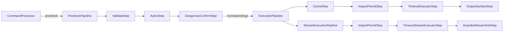

# Technical Design: 命令执行 Pipeline Step/Interceptor 链重构

## Technical Solution

### Core Technologies
- Java 8
- Maven（现有构建与测试体系保持不变）
- 现有组件复用：`InputValidator`、`AuthorizationManager`、`DangerousCommandConfirmationManager`、`PerformanceOptimizer`、`ThreadPoolExecutor`（CommandPipeline 内部）

### Implementation Key Points
- 在 `com.javasleuth.command` 下新增轻量的 pipeline 子包（建议：`com.javasleuth.command.pipeline`），引入：
  - `PipelineStep`（或分 `PrecheckStep` / `ExecutionStep`）接口
  - `StepChain`/`PipelineChain`：按顺序执行并支持短路（deny/fail）
  - `Invocation/Context`：携带 `entry/meta/commandName/rawArgs/normalizedArgs/CommandContext/StreamSink` 等信息
  - `Outcome`：统一的结果模型（precheck / sync / stream 三条路径各自保持现有返回类型，但内部可共用 outcome）
- 将 `CommandPipeline` 改造为 Facade：
  - 对外方法签名保持不变（`precheck`、`executePrechecked`、`executeStreamPrechecked`、`execute` 等）
  - 内部仅负责组装步骤链、调用链执行、以及做少量与旧 API 兼容的适配
- 以“现有行为为契约”固化步骤顺序与语义（核心点）：
  - 输入校验/授权使用 `stripConfirmArgs(rawArgs)`（confirm token 不参与校验/授权）
  - 危险命令确认步骤使用 rawArgs 完成 token 校验，并输出 normalizedArgs 进入执行阶段
  - 缓存 key 必须包含 clientId；并保留 `session` 不缓存、`dashboard realtime` 绕过缓存等逻辑
  - impact permit 必须在提交 executor 前获取，并在所有路径（成功/异常/超时/拒绝/中断）释放
  - 流式输出沿用 GuardedStreamSink：按 chunk sanitize；成功 close 一次；失败 error 一次且不额外 close

## Architecture Design

## Architecture Decision ADR

### ADR-004: 引入 Pipeline Step/Interceptor 链（命令执行链显式化）
**Context:** `CommandPipeline`/`CommandProcessor` 承载了过多职责，导致扩展与测试成本上升；同时存在同步与流式两条执行路径，容易出现“某条路径绕过安全/治理”的风险。

**Decision:** 引入可插拔步骤链，将 validate/authz/confirm/cache/impact/timeout/sanitize 等逻辑拆分为独立 Step，并由 `CommandPipeline` 作为 Facade 统一编排与对外暴露旧 API。

**Rationale:**
- 将“隐式流程”变为“显式步骤”，单测可以针对单个步骤编写，回归更聚焦
- 扩展点清晰：新增治理策略/观测点只需新增 Step 并插入顺序
- 兼容风险可控：Facade 保持旧 API，逐步迁移内部实现

**Alternatives:**
- Solution 1（渐进式职责分层拆分）→ 拒绝原因：仍可能保留隐式流程与分散 try/catch，步骤级可测性提升有限
- Solution 3（子系统重包 + 子命令框架化）→ 拒绝原因：短期改动面更大、回归风险更高，不适合作为第一步

**Impact:**
- 正向：流程显式化、测试与扩展更容易、巨型类体积可显著下降
- 负向：引入少量抽象与文件数增加，需要严格控制步骤顺序与性能开销

## API Design
无（对外协议与命令接口保持不变）。

## Data Model
无。

## Security and Performance
- **Security:**
  - 严格保持输入校验、授权、危险命令确认的既有语义与顺序
  - confirm token 不参与校验/授权；normalizedArgs 不再携带 token
  - 流式输出统一走 sanitize（按 chunk），避免绕过输出治理
- **Performance:**
  - Step 设计为“薄封装”，避免在热路径上产生过多对象
  - 继续沿用 `CommandPipeline` 现有线程池与队列上限配置，避免资源治理语义漂移

## Testing and Deployment
- **Testing:**
  - 现有测试作为回归契约：`CommandPipeline*`、`CommandProcessor*`、`DangerousCommandConfirmationManagerTest`、`RequestSecurityManagerTest` 等必须保持通过
  - 新增步骤级单测：覆盖步骤顺序、args 归一化、permit 释放、stream close/error 语义
  - 执行：`mvn test`
- **Deployment:** 无部署变更；属于纯代码重构，按现有发布流程即可。
