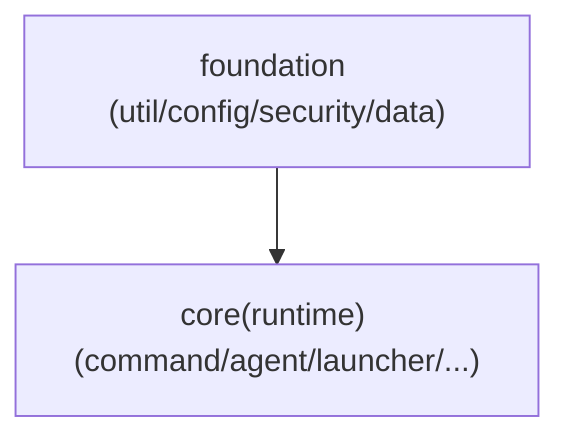

# Technical Design: 恢复分层边界（Maven 多模块化 + ArchUnit 守护）

## Technical Solution

### Core Technologies
- Java 8 / Maven（项目现状）
- ArchUnit（JUnit4 规则，用于分层与循环依赖守护）
- maven-assembly-plugin（继续产出 `jar-with-dependencies`，保持 Agent/Launcher 入口不变）

### Implementation Key Points
1. **模块拆分策略（最小可行且可持续演进）**
   - 新增 `foundation` 模块：承载低层基础能力，包含以下包（包名保持不变，降低迁移成本）：
     - `com.javasleuth.util`
     - `com.javasleuth.config`
     - `com.javasleuth.security`
     - `com.javasleuth.data`
   - 现 `core` 模块定位为 `runtime`：保留 `command/agent/launcher/enhancement/monitor/...` 等高层能力，并显式依赖 `foundation`。

2. **拆环落地要点（对应 why.md 的关键环）**
   - `security <-> command`：
     - 将 `CommandMeta` 下沉到 `foundation`（建议归属到 `security` 侧或 `foundation.api`），从结构上消除双向依赖。
   - `util -> command`：
     - `SleuthLogger` 去掉对 `CommandContextHolder` 的编译期依赖；
     - 在命令执行入口（例如 pipeline/engine）写入 `SleuthLogContext.setCommand(...)`，日志上下文由低层 ThreadLocal 获取。
   - `command -> agent`：
     - `stop` 命令改为调用注入的生命周期回调（接口位于 `command` 侧，agent 负责注入实现），避免直接 import `SleuthAgent`。

3. **构建期守护（ArchUnit）**
   - 规则 1：`com.javasleuth.command..` 不允许依赖 `com.javasleuth.agent..`
   - 规则 2：顶层包 slices（`com.javasleuth.(*)..`）应当 `beFreeOfCycles()`
   - 规则 3（可选增强）：对 `foundation` 相关包建立更严格的 dependency whitelist（防止未来“偷跑 import”导致再次反向依赖）

## Architecture Design

## Architecture Decision ADR

### ADR-008: 采用 Maven 多模块 + ArchUnit 作为分层守护
**Context:** 当前 `core` 内部包分层失守并形成依赖环，导致重构与测试成本快速上升；单靠“约定”无法防止回归。  
**Decision:** 引入最小可行 Maven 多模块边界（`foundation` / `core(runtime)`），并在 `core` 测试中引入 ArchUnit 规则作为持续守护。  
**Rationale:**
- Maven 模块边界提供“不可编译”的硬约束，能从根上阻止低层反向依赖高层；
- ArchUnit 提供更细粒度的包级规则与循环依赖检测，覆盖同模块内的“隐性环”。  
**Alternatives:**
- 仅做 ArchUnit、不拆模块：拒绝原因——缺乏编译期硬边界，容易被绕过（或通过 test scope/反射等方式侵蚀）。
- 细粒度拆成多模块（每个包一个模块）：拒绝原因——一次性改动面过大，容易引入大量短期不稳定与打包/依赖迁移成本。  
**Impact:** 构建结构更清晰，可持续演进；短期需要完成依赖迁移与少量解耦重构，并补齐守护测试。

## Security and Performance
- **Security:** 不改变现有认证/授权/危险命令确认语义；重点在“把安全元信息（CommandMeta）放回低层 SSOT”以避免双向依赖与语义漂移。
- **Performance:** 运行时性能不预期变化；构建期会新增模块与 ArchUnit 测试，预计构建时间小幅增加（可接受）。

## Testing and Deployment
- **Testing:**
  - `mvn test`：确保模块拆分后单测继续通过
  - ArchUnit 规则：确保分层违规在 PR 阶段即失败
- **Deployment/Packaging:**
  - `mvn package`：确保 `*-jar-with-dependencies.jar` 产物仍包含 Agent/Launcher 所需类与依赖
  - 手工冒烟：运行 `sleuth.sh`，验证 `JarLocator` 能定位 jar 并完成 attach/握手/执行基本命令

