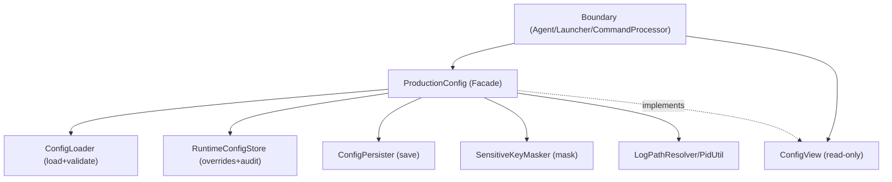

# Technical Design: 降低 ProductionConfig 架构吸力（拆分职责 + 明确运行时可变语义）

## Technical Solution

### Core Technologies
- Java 8 / Maven
- 不引入新的第三方依赖（保持 Agent/Launcher 轻量）
- JUnit4（现有测试框架）

### Implementation Key Points
1. **最小接口化（先收敛依赖形态）**
   - 引入 `ConfigView`（只读）与 `MutableConfig`（仅用于运行时覆盖写入）
   - 引入 `ConfigOrigin`（RUNTIME/SYSTEM/FILE/DEFAULT）与 `ConfigSnapshot`（不可变快照，可选）
2. **职责拆分（拆掉 God Config 的“杂项吸力”）**
   - `ConfigLoader`：负责加载默认资源/外部文件/系统属性覆盖，并做 key 校验
   - `RuntimeConfigStore`：仅承载运行时 overrides，支持变更记录（key/old/new/source/ts）
   - `ConfigPersister`：保存配置（是否包含 runtime overrides）
   - `SensitiveKeyMasker`：集中脱敏策略（key 识别 + value mask）
   - `LogPathResolver` / `PidUtil`：默认日志路径与 PID 获取
3. **ProductionConfig 退化为 Facade（组合与读取门面）**
   - `ProductionConfig` 继续对外提供现有 `getXxx()`（短期兼容）
   - 内部委托给 loader/store/persister/masker 等组件，减少单文件职责与复杂度
4. **降低隐式依赖（渐进迁移）**
   - boundary 层集中持有 `ProductionConfig` 实例，并向下传递 `ConfigView`
   - 核心组件按需依赖窄接口（优先依赖 `ConfigView`，避免再散落 `getInstance()`）
5. **可观测性增强**
   - `RuntimeConfigStore` 维护变更序号（change counter）与最近 N 条变更（仅存脱敏摘要）
   - `ProductionConfig.getConfigStatus()` 输出 runtime overrides 数量与最近变更摘要（可选）
6. **可选：请求级一致性快照**
   - 在命令执行入口捕获 `ConfigSnapshot` 并传递到执行链路，避免“同一请求内读到混合状态”

## Architecture Design

## Architecture Decision ADR

### ADR-009: 引入 ConfigView + RuntimeConfigStore，渐进降低 ProductionConfig 全局单例吸力
**Context:** `ProductionConfig` 单文件职责过载且以全局单例形态暴露，导致隐式依赖与运行时可变语义混杂。  
**Decision:** 保持短期兼容（`ProductionConfig` 继续存在）但引入只读 `ConfigView`/可写 `MutableConfig` 以及 `RuntimeConfigStore`，并把加载/保存/脱敏/路径等拆分为独立组件；逐步迁移调用点依赖窄接口而非全局单例。  
**Rationale:**
- 在不引入 DI 框架的前提下，先用接口/组件拆分降低吸力中心；
- 兼顾短期稳定与长期演进：先兼容现有调用，再逐步把“直接 getInstance”收敛到 boundary。
**Alternatives:**
- 彻底引入 DI 框架并全量改造：拒绝原因——改动面过大、风险不可控。
- 仅重排 `ProductionConfig` 内部方法、不引入接口：拒绝原因——隐式依赖与语义混杂问题仍在。
**Impact:** 需要新增若干小类与测试，并逐步调整调用点；长期可显著降低配置层的耦合与排查成本。

## Security and Performance
- **Security:**
  - 运行时覆盖（`config set` / 启动自举）必须记录变更来源与时间；敏感字段统一脱敏
  - 对安全关键项建议引入 allowlist（例如允许调试项，限制 `security.*` 的高风险写入）
- **Performance:**
  - 读取路径保持 O(1)（runtime map + system prop + properties）
  - 快照（可选）为一次性 map copy，避免在高频路径强制启用；仅在命令入口使用

## Testing and Deployment
- **Testing:**
  - 配置读取优先级（runtime > system > file/default）
  - runtime overrides 写入可追溯（source/ts/脱敏）
  - saveConfiguration(includeRuntimeOverrides) 行为与脱敏一致性
  - （可选）ConfigSnapshot 一致性语义
- **Deployment:**
  - `mvn test` / `mvn package` / `mvn verify`
  - 冒烟：启动 Launcher + attach，验证 `config get/set/save` 与安全模式切换路径不回归
