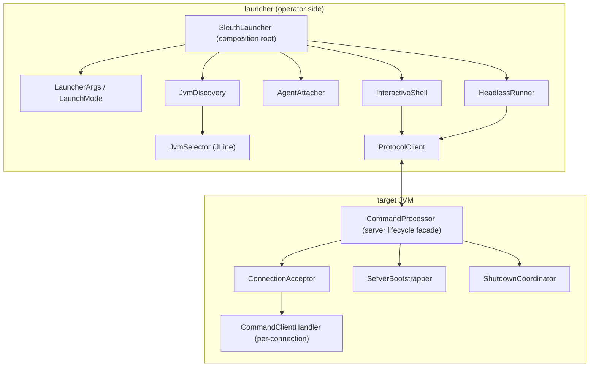

# Technical Design: Launcher/CommandProcessor 去 God class（可插拔运行模式）

## Technical Solution

### Core Technologies
- Java 8
- Attach API（`com.sun.tools.attach.VirtualMachine`）
- Socket + HELLO/CONFIG 握手 + framed/binary 协议
- JLine（仅用于 interactive shell）

### Implementation Key Points
1. **Launcher 作为 composition root**
   - 保留 `SleuthLauncher` 作为入口（`main`），但将业务逻辑委托给可测试组件。
2. **可插拔运行模式（Interactive / Headless）**
   - `interactive`：保持现有体验（JLine 交互、选择 JVM、进入 `sleuth>`）。
   - `headless`：支持 `--pid` + `--cmd` / `--script`，用于自动化编排、CI、自助排障脚本。
3. **协议客户端抽象**
   - `ProtocolClient` 负责握手协商、协议升级、请求发送与响应读取。
   - `InteractiveShell` 只负责读取用户输入与显示输出；`HeadlessRunner` 只负责按脚本/命令驱动 `ProtocolClient`。
4. **Server lifecycle 组件化**
   - `CommandProcessor` 聚焦生命周期门面（start/stop/restart），accept 循环、bootstrap 自举、shutdown 编排拆为可替换组件。

## Architecture Design

## Architecture Decision ADR

### ADR-012: 引入 LaunchMode + ProtocolClient，Launcher 退化为装配入口
**Context:** `SleuthLauncher` 当前同时承担 JVM 发现/选择、Attach、配置与安全确认、握手协商、协议收发、JLine 交互与 IO loop，导致变更范围大、难以单测。  
**Decision:** 引入 `LaunchMode`（interactive/headless）与 `ProtocolClient` 抽象；`SleuthLauncher` 只保留参数解析与组件装配，交互/协议/Attach 拆分为独立组件。  
**Rationale:** 降低耦合、提升可测试性与可演进性；为 headless 自动化能力提供结构支撑，并保持默认交互行为兼容。  
**Alternatives:**
- Solution 1（增量拆分，不引入运行模式）：可行但无法系统化支持脚本化执行，仍保留较多交互与协议纠缠。  
- Solution 2（抽公共模块到 foundation）：长期收益高但跨模块移动更大、回归风险更高。  
**Impact:** 新增一批 launcher 侧组件与接口；需要补单测与集成测试锁定协议语义；对外新增可选 CLI 参数。

### ADR-013: CommandProcessor 按“bootstrap/accept/shutdown”拆分为组件
**Context:** `CommandProcessor` 仍包含启动自举（JobManager/HMAC/日志 provider）、accept 循环/过载拒绝、shutdown/restart 编排等多类职责。  
**Decision:** 将这些职责拆分为 `ServerBootstrapper`、`ConnectionAcceptor`、`ShutdownCoordinator` 等组件，`CommandProcessor` 保留生命周期门面并负责装配默认实现。  
**Rationale:** 降低修改牵连、便于单测覆盖“过载拒绝/关闭顺序/自举策略”等关键行为。  
**Alternatives:** 继续在单类内通过 region 划分与注释约束 → 长期仍会演化回巨型类。  
**Impact:** server 侧结构更清晰，可在不触碰协议 handler 的前提下迭代接入策略（例如不同 accept 策略/限流）。

## API Design
本变更优先保持现有交互入口不变；新增 headless 相关参数作为可选能力（以实现为准）：
- `--pid <pid>`：跳过交互选择，直接 attach 到指定 PID
- `--cmd "<command>"`：执行单条命令并退出
- `--script <file>`：从脚本文件读取命令并执行
- `--fail-fast`：脚本模式遇到错误立即停止（默认可继续）

## Data Model
N/A

## Security and Performance
- **Security:**
  - 继续保留 `--insecure` 的显式确认机制；headless 模式下需引入等价的“不可静默确认”策略（例如额外参数或一次性确认 token）。
  - `security.mode=hmac` 的签名绑定保持一致：`connId` 作为连接绑定因子，避免重放与串线。
  - 脚本/文件输入需复用现有 `SecurityValidator.canReadFile`（或同等校验）避免读取敏感路径（best-effort）。
- **Performance:**
  - headless 模式绕开 JLine 与复杂 UI，减少交互开销，便于批处理。
  - 复用现有 framed/binary 协议与服务端背压策略，避免新增无限缓存。

## Testing and Deployment
- **Testing:**
  - Launcher：`LauncherArgs`、握手 KV 解析、connectHost 解析、stream policy 单测。
  - Server：`ConnectionAcceptor` 过载拒绝判断与回包（可用 mock socket/stream 或可注入 writer）单测。
  - 集成：本机启动 `CommandProcessor`（loopback + ephemeral port）→ `ProtocolClient` 完成握手并执行轻量命令，验证 framed/binary 路径。
- **Deployment:**
  - 产物保持：`java-sleuth-launcher`（控制端）+ `java-sleuth-agent`/`java-sleuth-agent-core`（目标 JVM）。
  - 文档同步：更新 `helloagents/wiki/modules/launcher.md`、`helloagents/wiki/modules/command.md` 与 `docs/usage/*` 中 CLI 说明（如新增 headless 参数）。

