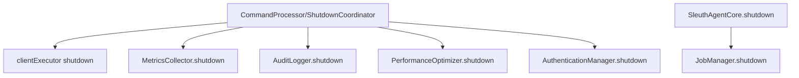

# Technical Design: 线程与生命周期治理（Threading & Lifecycle Governance）

## Technical Solution

### Core Technologies
- Java 8
- JDK concurrency primitives: `ThreadFactory` / `ThreadPoolExecutor` / `ScheduledExecutorService`

### Implementation Key Points

1. **统一线程创建工具（foundation）**
   - 提供可复用的 daemon ThreadFactory（统一命名、priority、UncaughtExceptionHandler）。
   - 提供统一的 `ExecutorService` shutdown/awaitTermination 辅助方法，避免每处重复实现超时逻辑。

2. **AuthenticationManager 会话清理任务可控（foundation）**
   - 将当前 “`new Thread` + 无限循环 sleep” 的实现，收敛为可关闭的调度器（或可停止线程）。
   - 增加 `shutdown()`（幂等）并在 shutdown 后允许重启（必要时清理/重置 instance 或内部 executor）。

3. **shutdown 编排补齐（core）**
   - 在 `ShutdownCoordinator` 的 graceful/emergency 关闭路径中，增加对 `AuthenticationManager` 的停止（避免 stop 后残留）。
   - 保持现有 shutdown 顺序：先停接入与连接 → 再停 executor → 再停后台服务（metrics/audit/perf/auth 等）。

4. **JobManager 生命周期与上下文传播（core）**
   - 为 JobManager 增加 `shutdown(reason)`：stopAll + 关闭 executor + awaitTermination。
   - 在提交后台任务时捕获当前 `CommandContextHolder` / `SleuthLogContext`，在 job 线程执行前写入，执行后清理，避免 ThreadLocal 串号。

## Architecture Design

（逻辑视图）

## Architecture Decision ADR

### ADR-011: 将后台任务生命周期纳入统一 shutdown 编排
**Context:** 多个后台线程/线程池由各组件自行启动，部分不支持 shutdown，导致 stop/detach 后仍残留线程并持续运行。  
**Decision:** 引入统一线程工具与可关闭的后台任务设计，将关键后台任务纳入 `ShutdownCoordinator`/`SleuthAgentCore.shutdown` 的编排。  
**Rationale:**  
- 降低线程策略漂移与排障成本  
- stop/detach 后更可预测、更利于长期稳定运行  
- 为未来扩展（Web UI/headless client/更复杂协议）提供“可治理的运行时基座”  
**Alternatives:**  
- 方案 A：保持 daemon 线程不关闭 → 拒绝原因：长期残留线程与任务，影响稳定性与可观测性，detach 语义不完整  
- 方案 B：全量引入复杂生命周期框架（Service container） → 拒绝原因：改动面过大，优先用轻量可测试的 shutdown 编排满足现阶段需求  
**Impact:**  
- 增加少量公共工具类与 shutdown 代码  
- 需要补充单测覆盖 shutdown/重启边界  

## Security and Performance

- **Security:**  
  - 统一线程命名与异常记录，减少“后台吞异常”造成的不可见失败。  
  - 上下文传播确保审计/日志关联字段准确，避免跨会话串号引发误判。  
- **Performance:**  
  - shutdown 中使用有界等待（timeout），避免无限阻塞。  
  - JobManager executor 关闭可释放线程资源，减少目标 JVM 常驻开销。  

## Testing and Deployment

- **Testing:**  
  - `mvn test`（全量单测）  
  - 补充/更新单测：`AuthenticationManager` shutdown 幂等与可重启；JobManager 上下文清理基本行为（尽量避免时间敏感与 flaky）。  
- **Deployment:**  
  - 代码内部治理变更，无需额外部署步骤。  
  - 建议在典型 attach → 执行命令 → stop → 再 attach 的手工流程中做一次验证（观察线程列表与日志）。  

