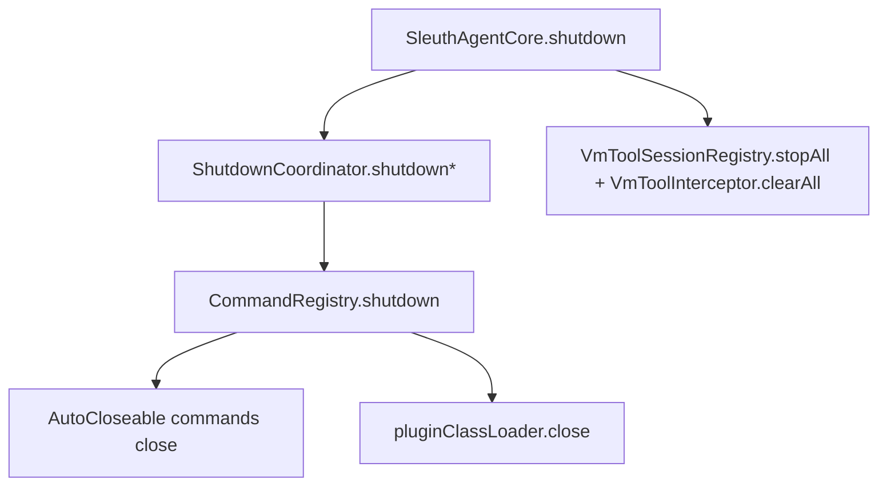

# Technical Design: 架构边界收敛 + 生命周期治理 + 单例显式化（v2）

## Technical Solution

### Core Technologies
- Java 8
- Maven multi-module
- JDK `ExecutorService` / `ScheduledExecutorService`
- `AutoCloseable`（作为轻量、可选的生命周期扩展点）

### Implementation Key Points
1. **ProtocolClient 注入安全管理器（Launcher）**
   - 新增 `ProtocolClient.connect(..., RequestSecurityManager securityManager)` 重载（或 builder），默认路径仍使用 `RequestSecurityManager.getInstance()`。
   - `ProtocolClient` 内部不再固定在构造器里调用 `getInstance()`，避免隐式单例依赖。

2. **CommandRegistry shutdown 扩展（Core）**
   - 在 `CommandRegistry.shutdown()` 中，在关闭 plugin classloader 之前，best-effort 遍历已注册命令：
     - 若命令实现了 `AutoCloseable`，调用 `close()` 释放后台线程/资源。
   - 关闭顺序：先关命令资源 → 再关 plugin classloader（避免 close 过程中引用到插件类时 classloader 已释放）。

3. **ProfilerCommand 纳入生命周期治理（Core）**
   - `ProfilerCommand implements AutoCloseable`：
     - `close()` 调用内部 `stopProfiling()` 的“无抛异常”版本（或提取 `shutdownScheduler()`），确保 shutdown 场景不残留定时线程。
   - 保持原有 CLI 行为不变（`profiler stop/status/report` 等）。

4. **vmtool detach 清理闭环（Core + bootstrap）**
   - 在 `SleuthAgentCore.shutdown()` 中新增 best-effort：
     - `VmToolSessionRegistry.getInstance().stopAll(inst, transformer, "shutdown")`
     - 兜底 `VmToolInterceptor.clearAll()`（即使 stopAll 失败也尽量清理静态缓存）
   - 位置建议在 removeAllEnhancers 之前，避免 session 持有 enhancer 引用残留。

5. **Jar 定位逻辑收敛（Bootstrap/Agent）**
   - 在 `JarLocator` 增加通用方法：从 `ProtectionDomain/CodeSource` 定位当前 jar（不做 marker 限制）。
   - `SleuthAgent.locateOwnJar()` 改为调用 `JarLocator` 新方法，减少重复实现。

## Architecture Design

## Architecture Decision ADR

### ADR-012: 使用 AutoCloseable 作为命令生命周期的可选扩展点
**Context:** 部分命令会启动后台线程/调度器（Profiler 等），但现有 `Command` 接口不包含生命周期钩子，导致 shutdown 时难以统一治理。  
**Decision:** 不修改 `Command` 接口（避免破坏性变更），而是在 `CommandRegistry.shutdown()` 中识别并调用 `AutoCloseable.close()` 作为可选扩展点。  
**Rationale:**  
- Java 标准接口、零依赖、对插件友好  
- 对既有命令无影响，属于“按需实现”的渐进式治理  
**Alternatives:**  
- 方案 A：扩展 `Command` 增加 `shutdown()` → 拒绝原因：破坏插件接口与已有实现  
- 方案 B：引入自定义 `Lifecycle` 接口 → 可行但标准性更弱，可作为未来补充  
**Impact:**  
- shutdown 路径会 best-effort 调用 close（需吞异常并保证幂等）  

## Security and Performance
- **Security:** ProtocolClient 允许注入 signer/manager，有利于更严格的 key 管理与隔离测试；默认行为不变。
- **Performance:** vmtool stopAll 可能增加一次 retransform，但仅在 shutdown 路径触发；可接受。

## Testing and Deployment
- **Testing:** `mvn test` 覆盖既有单测；新增/调整单测以覆盖：
  - vmtool stopAll 在 shutdown 后状态清理
  - ProfilerCommand 在 CommandRegistry.shutdown 后 scheduler 不残留（行为级验证）
- **Deployment:** 无产物命名变更；仅内部可注入/可关闭能力增强。

