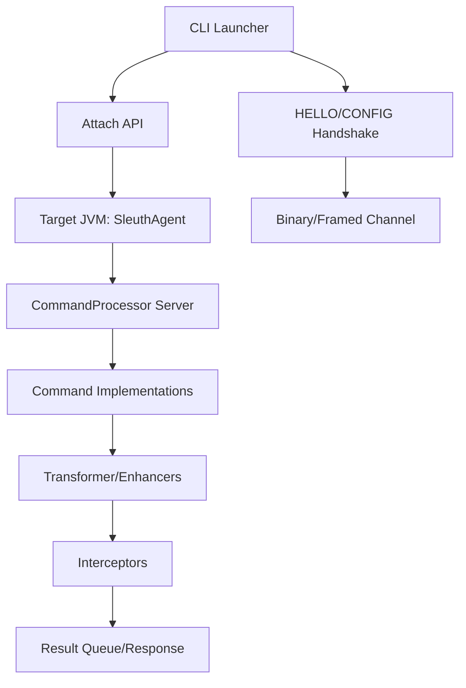
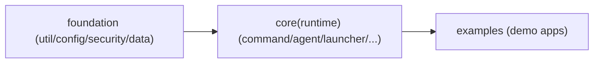

# Architecture Design

## Overall Architecture

## Tech Stack
- **Backend:** Java 8, Maven
- **Diagnostic:** Attach API, Instrumentation
- **Bytecode:** ASM
- **CLI:** JLine
- **Monitoring:** JMX（可选）

## Build Modules / Layering Guardrails

### Maven 模块边界（编译期硬约束）

约束要点（SSOT）：
- `foundation` 必须保持低层纯净：不得依赖 `core`（否则直接编译失败）
- `core` 作为 runtime 层：依赖 `foundation`，并通过打包插件继续产出 `*-jar-with-dependencies.jar`

### 分层守护策略（不引入架构测试）
- 当前不启用 ArchUnit 等“架构约束测试”，避免在 `src/test/java` 中引入分层守护逻辑
- 分层边界以 Maven 模块边界为主（`foundation -> core(runtime)`），通过编译期约束阻断低层反向依赖高层

## Resource Governance / Backpressure
- **连接侧背压**：`CommandProcessor` 使用有界队列处理新连接，队列满会拒绝新连接（避免无限排队导致内存上涨）
  - `server.max.connections`：并发连接上限
  - `server.executor.queue.capacity`：连接处理线程池排队上限
- **命令执行侧背压**：`CommandPipeline` 使用有界命令执行线程池替代 `Executors.newCachedThreadPool`
  - `performance.command.executor.core/max/queue.capacity`：命令执行线程池与队列上限
  - 队列满时返回明确错误（避免线程膨胀与排队失控）
- **重型命令治理**：对 `impact=HIGH` 的命令统一二次确认与并发限制
  - `security.impact.high.confirm.enabled`
  - `security.impact.high.concurrent.limit`

## Core Flow

## Major Architecture Decisions
| adr_id | title | date | status | affected_modules | details |
|--------|-------|------|--------|------------------|---------|
| ADR-001 | Attach + Socket CLI 架构 | 2026-01-28 | ✅Adopted | launcher/agent/command | 待补充 |
| ADR-002 | 插件化命令与分帧协议并行兼容 | 2026-01-28 | ✅Adopted | command/launcher/security/enhancement/monitor | history/2026-01/202601281207_sleuth_plugin_stream/how.md#adr-002-插件化命令与分帧协议并行兼容 |
| ADR-003 | HELLO/CONFIG 握手 + 严格二进制帧 + 可选 HMAC | 2026-01-28 | ✅Adopted | launcher/command/security/config | history/2026-01/202601281301_sleuth_handshake_secure_frames/how.md |
| ADR-004 | legacy 文本协议 sync 响应以 END marker 作为确定边界 | 2026-02-08 | ⚠️Superseded | command/launcher/security | history/2026-02/202602081451_legacy_text_end_marker_sync/how.md |
| ADR-005 | 移除 legacy 文本协议，统一使用 framed/binary | 2026-02-08 | ✅Adopted | command/launcher/config/docs | history/2026-02/202602081630_drop_legacy_protocol/how.md |
| ADR-006 | 强制新协议（无旧实现/旧配置兼容） | 2026-02-08 | ✅Adopted | command/launcher/security/config | history/2026-02/202602081900_enforce_new_protocol_only/how.md |
| ADR-007 | HMAC 签名协议收敛为单一格式（禁用 v 字段） | 2026-02-08 | ✅Adopted | launcher/security/command | history/2026-02/202602081959_remove_compat_paths/how.md |
| ADR-008 | 分层边界守护：foundation 模块边界 | 2026-02-10 | ✅Adopted | foundation/core | history/2026-02/202602101815_layering_modularization/how.md |

### ADR-006: 强制新协议（无旧实现/旧配置兼容）

- Date: 2026-02-08
- Decision: 握手强制、配置严格化（拒绝旧配置键）、HMAC 签名只允许单一 `SIG` 格式（禁用 `v` 字段）+ `sid` 绑定。
- Rationale: 在无 legacy 客户端前提下，移除兼容/降级路径可降低协议错位风险与维护复杂度。
