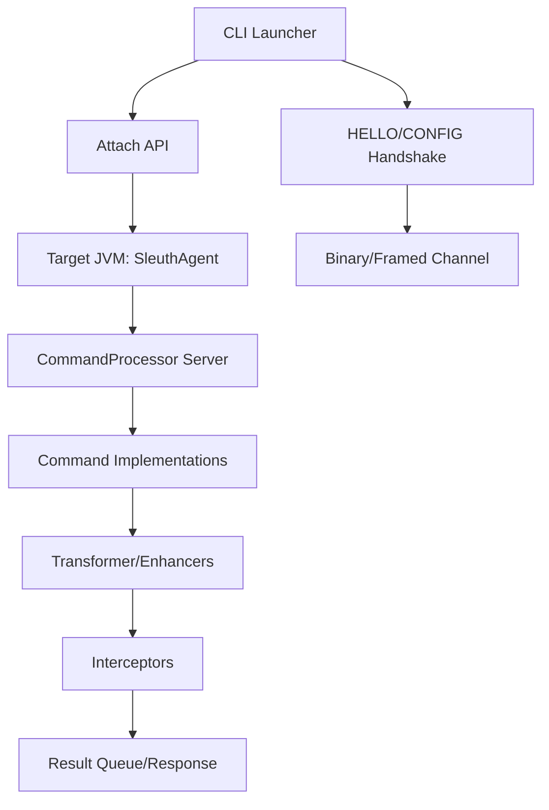
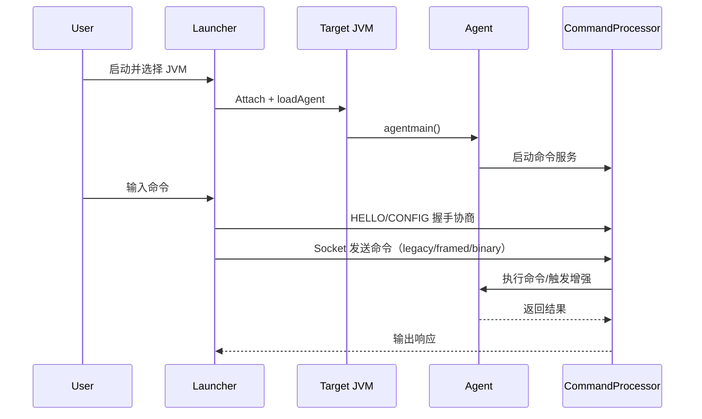

# Architecture Design

## Overall Architecture

## Tech Stack
- **Backend:** Java 8, Maven
- **Diagnostic:** Attach API, Instrumentation
- **Bytecode:** ASM
- **CLI:** JLine
- **Monitoring:** JMX（可选）

## Core Flow

## Major Architecture Decisions
| adr_id | title | date | status | affected_modules | details |
|--------|-------|------|--------|------------------|---------|
| ADR-001 | Attach + Socket CLI 架构 | 2026-01-28 | ✅Adopted | launcher/agent/command | 待补充 |
| ADR-002 | 插件化命令与分帧协议并行兼容 | 2026-01-28 | ✅Adopted | command/launcher/security/enhancement/monitor | history/2026-01/202601281207_sleuth_plugin_stream/how.md#adr-002-插件化命令与分帧协议并行兼容 |
| ADR-003 | HELLO/CONFIG 握手 + 严格二进制帧 + 可选 HMAC | 2026-01-28 | ✅Adopted | launcher/command/security/config | history/2026-01/202601281301_sleuth_handshake_secure_frames/how.md |
